## Problem Statement
  
Improve software development performance by integrating automated testing and continuous integration tools and streamlining deployment processes to improve code quality.

    *Unit Testing:
    
    *Integration Testing:
    
    *Continuous Integration:
---

## Approach
I took My wd301 capstone project as an example to illustrate this problem statement.

GitHub repo I worked on : https://github.com/chandramoulisangabathula01/sporthive/tree/master

For unit testing I used jest, not the first time to use jest for testing which I have already experienced working with on wd201 and wd301. So I tried to get involved in unit testing in Sporthive but unfortunately it failed many times 
so to not give up on them I worked on e2e testing where as it worked very well after a good understanding

First I used Wsl -linux and then I tried to use jest and cypress both failed so then I moved to windows and since then cypress is working on windows but I can't work with jest work so jest is needed now And I will explain the benefits

## jest
### advantages:
  
  1.Jest runs tests in parallel and only tests what has changed, making it faster. It also has features like snapshot testing and built-in code coverage.

  2.It is easy to format and has a clear, straightforward syntax that makes writing tests easier.

  3.Jest works seamlessly with React, making it easy to test individual components, including their definitions, props, state transitions and interactions.

  4.Jest’s built-in mocking capabilities help to isolate and test React components without the need for external dependencies.

  5.Jest is widely accepted in the React community, which means that there are many features, plugins, and community support.
  
---

## Code Coverage

Code coverage tools measure how well our tests exercise our code. Key metrics include:

  * **Function Coverage:** Checks if all functions have been called.
  * **Statement Coverage:** Measures how many lines of code have been executed.
  * **Branch Coverage:** Ensures all paths in control structures (like if statements) have been tested.
  * **Condition Coverage:** Tests each boolean condition for both true and false.
  * **Line Coverage:** Shows how many lines of code have been executed.
    
These metrics help ensure our tests cover all important parts of your code.


## Cypress :

Cypress end-to-end (e2e) testing is testing your entire application from the user’s perspective. It ensures that all components and functionality work together as they do in a real-world environment. 
Create tests for your modern web applications, debug it visually, and automate your ongoing integration builds.

### Advantages:

  * **Real Browser Testing:** Runs tests directly in the browser, providing accurate results.
  * **Automatic Waiting:** Automatically waits for elements to appear and for commands to complete, reducing the need for manual delays.
  * **Easy Debugging:** Provides detailed error messages and snapshots of your application at the time of failure.
  * **End-to-End Scenarios:** Covers scenarios that a typical user would encounter, from logging in and performing actions to logging out.


##  Configuration of Testing Framework

  1. Install Cypress in project:

        * npm install cypress --save-dev

  2. Open Cypress

        * npx cypress open

  3. cypress.config.js

``` cypress.config.js

    import { defineConfig } from "cypress";

export default defineConfig({
  e2e: {
    setupNodeEvents(on, config) {
      // implement node event listeners here
    },
    baseUrl: "http://localhost:5173",
    specPattern: "cypress/e2e/**/*.cy.{js,jsx,ts,tsx}",
  },

  component: {
    devServer: {
      framework: "react",
      bundler: "vite",
    },
  },
});

```

4. write test :

``` signupForm.cy.ts
  describe('Signup Form Behavior', () => {
  beforeEach(() => {
    cy.visit('http://localhost:5173/signup');
  });

  it('should display the signup form elements correctly', () => {
    cy.get('form').should('be.visible');
    cy.get('input[name="userEmail"]').should('be.visible');
    cy.get('input[name="userPassword"]').should('be.visible');
    cy.get('button[type="submit"]').should('be.visible');
  });

```     

Basically first I run on wsl then cypress it was not supported so I switched to windows then everything is smooth and when I open with chrome its not working I shifted to my default firefox and then its working fine

## Proof of my Cypress tests worked:

### signupspec.cy.ts

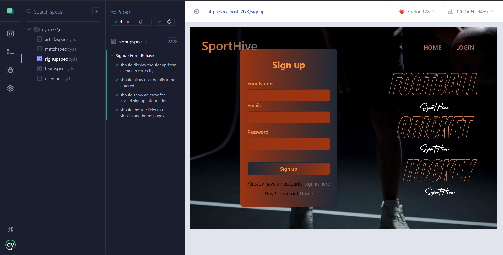

### matchspec.cy.ts

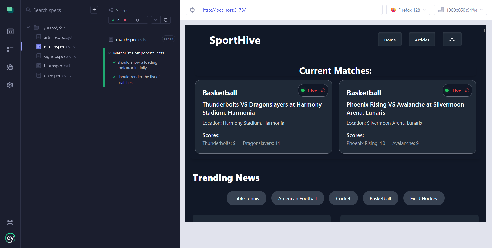

### articlespec.cy.ts

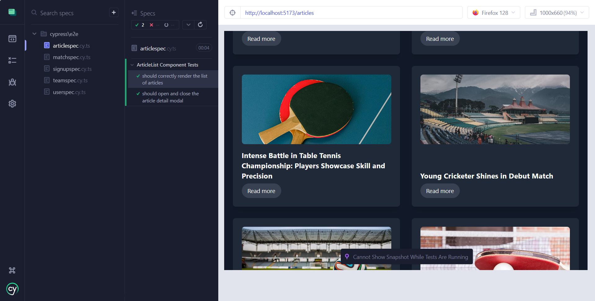

### teamspec.cy.ts

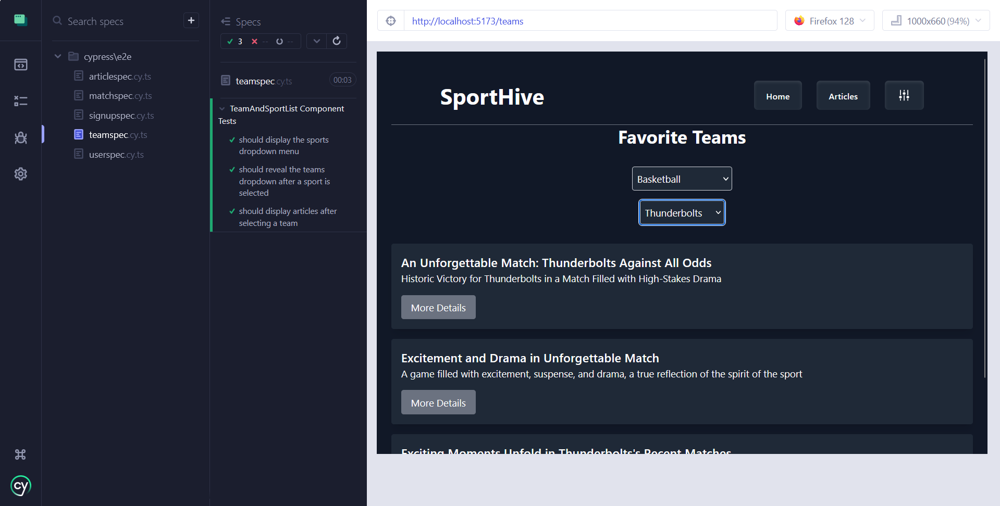

### userspec.cy.ts

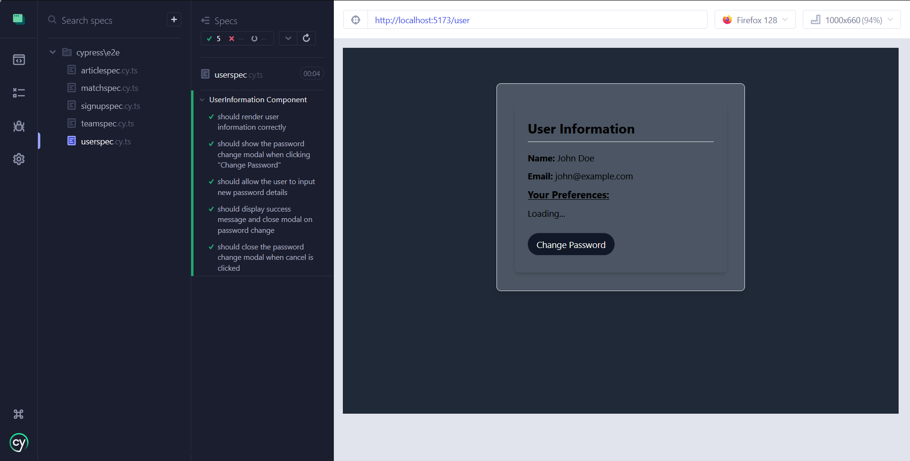

## when test failed in cypress app :

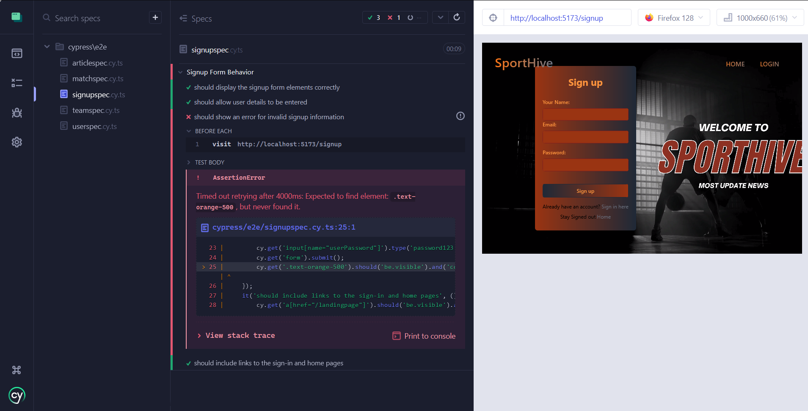

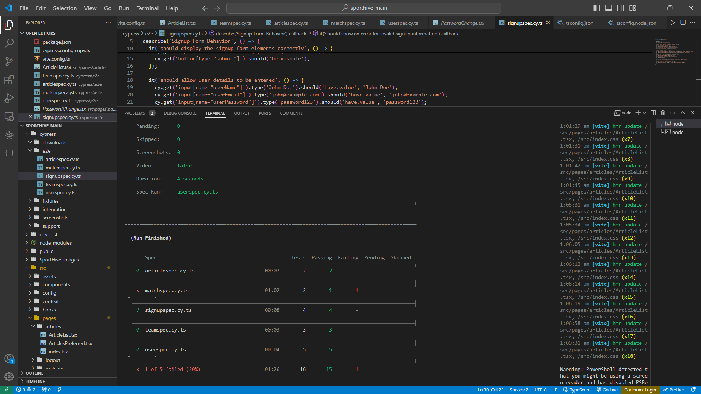


## Github Actions :

GitHub Actions is a CI/CD (Continuous Integration/Continuous Deployment) service provided by GitHub that allows you to automate workflows directly within your GitHub repository.

**Automation Platform:** Enables automation of various tasks, including building, testing, and deploying code.

**Workflow Automation:** Defines workflows that are triggered by events, such as code pushes, pull requests, or scheduled times.

**Seamless Integration:** GitHub Actions is built right into GitHub, so it’s incredibly easy to set up and start using. It’s like having everything in one place without needing to juggle multiple tools.


### config of github Actions :

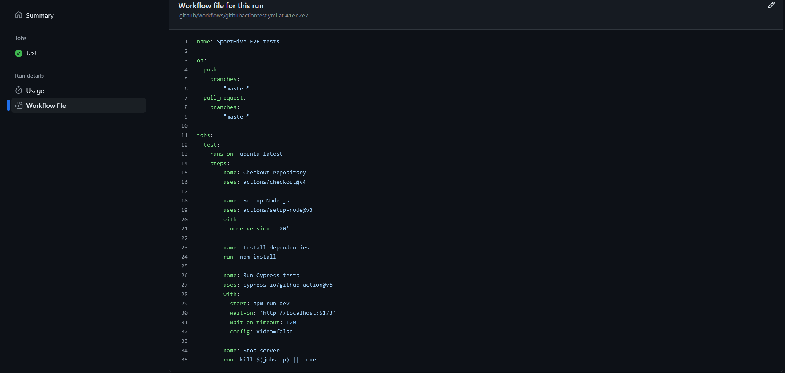

### lets see some fails

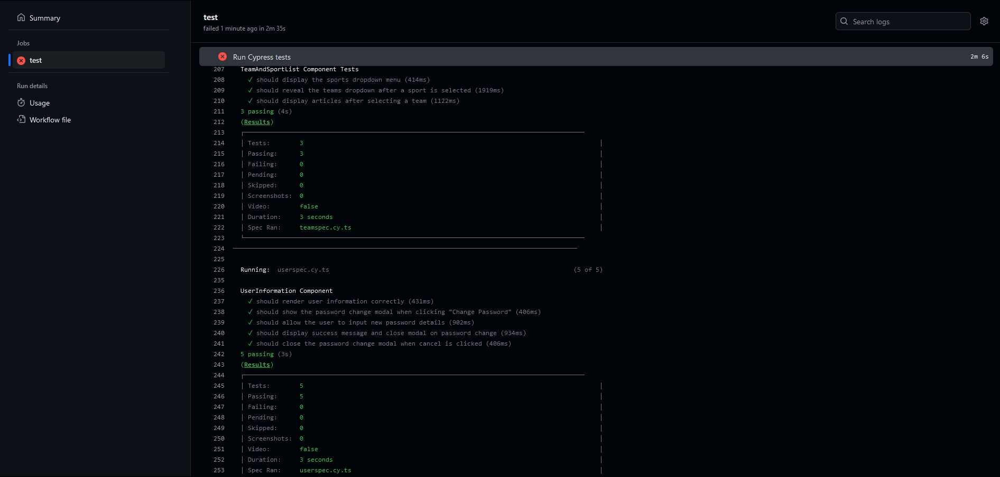


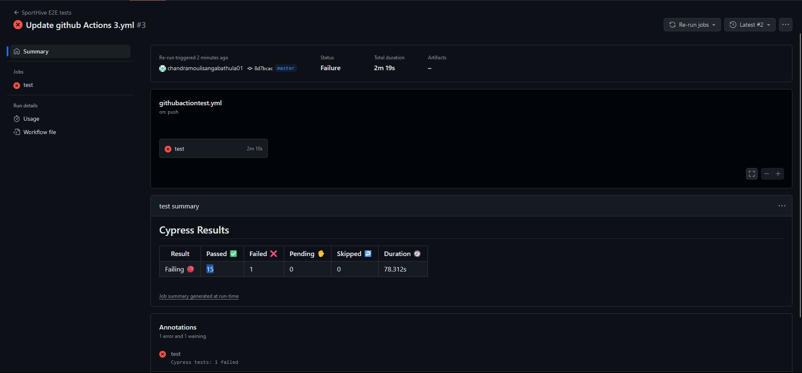


Now try to make sure that these issues are not visible due to cypress open or run due to timeout session , but when i tried to run in practice i found due to its delay so i increased the time to prevent this error tip.

## Passing test in Actions:

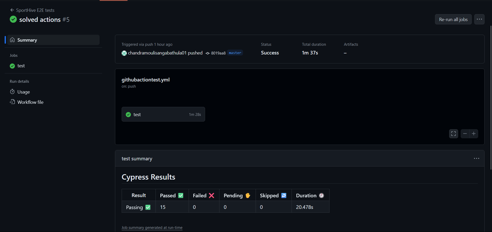

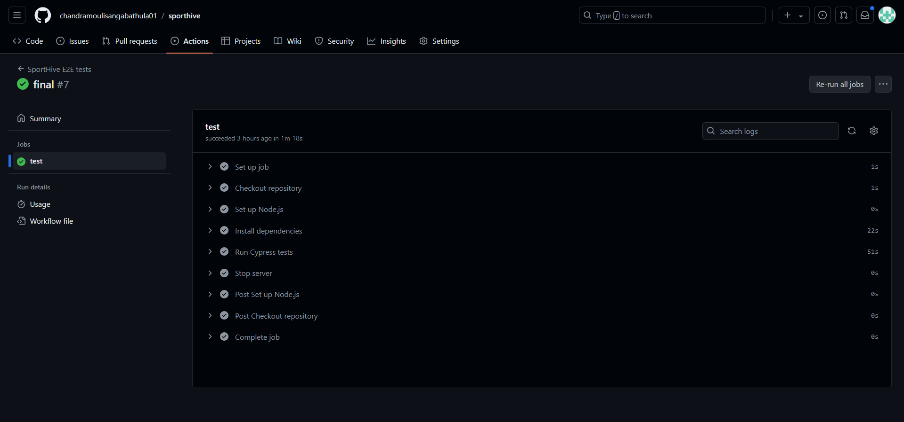


