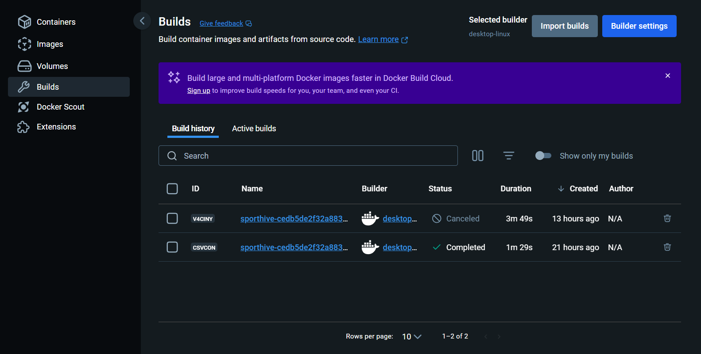
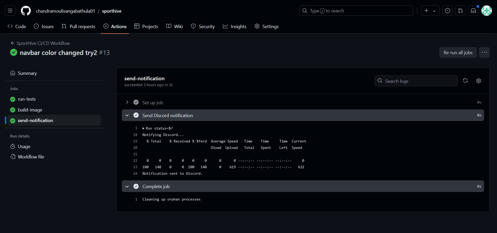
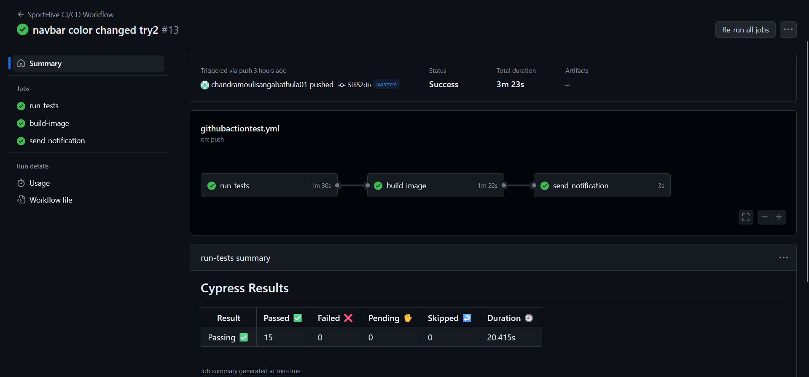
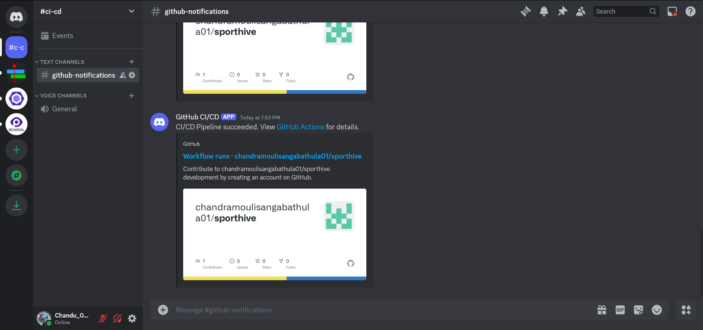
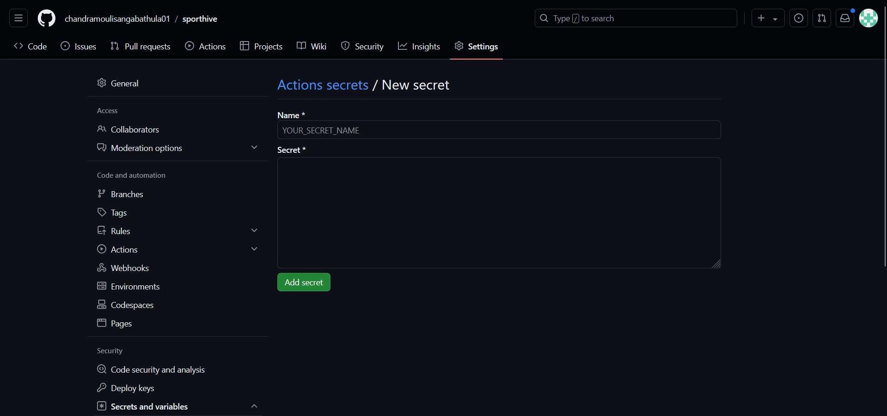

## Problem Statement
  
We've a Node.js application. Now we have to dockerize it and set up a CI/CD pipeline for it. The primary goal is to automate the deployment process, ensuring seamless integration of code changes and swift error detection

  * Dockerizing the application:
  * Configuration of environment variables:
  * Setup CI/CD pipeline using GitHub Actions:
  * Integration of automated test cases:
  * Integration of error reporting mechanisms:
  * Security Measures:
---

## Approach
I took My wd301 capstone project as an example to illustrate this problem statement.

GitHub repo I worked on : https://github.com/chandramoulisangabathula01/sporthive/tree/master

I worked on this project and implemented all the tasks like jest,cypress,github_actions,ci/cd,docker,env variables,and security.

## Dockerizing the application:

  Dockerizing an application involves packaging the application and its dependencies into a Docker container.
  This process provides a consistent environment for the application,
  
### advantages:
  
  1.Consistency Across Environments: Docker ensures that the application behaves the same way in development, testing, staging, and production environments by using the same Docker image. 
  
  2.Simplifies Dependencies Management : Docker packages the application with its dependencies, including the runtime and libraries, so we don’t need to worry about installing or configuring them separately on different machines.
  
  3.Easy Setup for New Developers: New team members can quickly set up their local development environment by running a Docker container without worrying about system-specific configurations or missing dependencies.

  4.Predictable Builds: CI/CD pipelines can build, test, and deploy Docker images consistently across different stages of the pipeline, ensuring reliable and repeatable results.

  5.Controlled Upgrades: Docker images can be versioned and updated independently, allowing we to manage and test dependency upgrades without affecting the host system or other applications.
  

  


---

## Configuration of environment variables:

Configuring environment variables within a Docker container is essential for managing settings such as API keys, database credentials, and other sensitive information. Proper management of these variables ensures that application runs securely and correctly. Below is a step-by-step guide on how to configure and document environment variables for a Node.js application within Docker.

``` docker.yml

  version: '3.8'

services:
  app:
    # Build the Docker image from the Dockerfile in the current directory
    build: .

    # Map port 5173 on the host to port 5173 in the container
    ports:
      - '5173:5173'

    # Load environment variables from a .env file
    env_file:
      - .env


```

Here if we see we have env_file in that .env present in that we store our api keys


For more secure for login credentials we use **Actions secrets and variables** .

  * To get this we have to navigate to the our_Repo/settings/secrets/actions.
  * In that we can see **Repository secrets** click on new repository secrets.
  * Now enter the Name* & Secret* and click on add secret.
  * our Repository secrets  has been created now we can use it any where in our repo.
 
    


## Setup CI/CD pipeline using GitHub Actions :


Setting up a CI/CD pipeline using GitHub Actions involves creating workflows to automate the build, test, and deployment processes of our application. GitHub Actions provides a powerful framework for creating and managing CI/CD pipelines directly within our GitHub repository.

### Step by step:
  1. Create a GitHub Actions Workflow File
 
      * Workflows are defined in YAML files located in the .github/workflows/ directory of our repository.
      * Each workflow file defines a series of jobs and steps to automate our CI/CD processes
  
``` githubactiontest.yml

name: SportHive CI/CD Workflow

on:
  push:
    branches:
      - "master"
  pull_request:
    branches:
      - "master"

jobs:
  run-tests:
    runs-on: ubuntu-latest
    steps:
      - name: Checkout code
        uses: actions/checkout@v4

      - name: Set up Node.js environment
        uses: actions/setup-node@v3
        with:
          node-version: '20'

      - name: Install project dependencies
        run: npm install

      - name: Execute Jest tests
        run: npm test
        
      - name: Execute Cypress tests
        uses: cypress-io/github-action@v6
        with:
          start: npm run dev
          wait-on: 'http://localhost:5173'
          wait-on-timeout: 120
          config: video=false

  build-image:
    runs-on: ubuntu-latest
    needs: run-tests
    steps:
      - name: Checkout code
        uses: actions/checkout@v4

      - name: Build Docker image
        run: |
          echo "Starting Docker image build..."
          docker build -t ${{ secrets.DOCKERHUB_USERNAME }}/sporthive:latest .
          echo "Docker image build completed."

      - name: Display Docker images
        run: docker images

      - name: Authenticate Docker Hub
        run: echo ${{ secrets.DOCKERHUB_PASSWORD }} | docker login -u ${{ secrets.DOCKERHUB_USERNAME }} --password-stdin

      - name: Push Docker image to repository
        run: |
          echo "Uploading Docker image..."
          docker push ${{ secrets.DOCKERHUB_USERNAME }}/sporthive:latest
          echo "Docker image uploaded successfully."

  send-notification:
    runs-on: ubuntu-latest
    needs: [run-tests, build-image]
    steps:
      - name: Send Discord notification
        if: always()
        run: |
          status=$?
          status_msg="failed"
          if [ $status -eq 0 ]; then
            status_msg="succeeded"
          fi
          echo "Notifying Discord..."

          message="{\"content\": \"CI/CD Pipeline $status_msg. View [GitHub Actions](${GITHUB_SERVER_URL}/${GITHUB_REPOSITORY}/actions) for details.\"}"

          curl -H "Content-Type: application/json" \
            -X POST \
            -d "$message" \
            ${{ secrets.DISCORD_WEBHOOK_URL }}

          echo "Notification sent to Discord."


```




2. Configure the Workflow Triggers
 
      * Workflows can be triggered by various events, such as push, pull_request, or schedule. Configure these triggers based on when we want the workflow to run.

3. Define Jobs and Steps
 
      * **Jobs:** A job is a set of steps that run on the same runner. Jobs can run in parallel or sequentially based on dependencies.
      * **Steps:** Steps are individual tasks within a job, such as checking out the code, installing dependencies, running tests, building Docker images, and deploying applications.

4. Use Actions for Common Tasks
 
      * GitHub Actions provides a marketplace with pre-built actions for common tasks, such as checking out code, setting up a Node.js environment, and interacting with Dock
      * **Steps:** Steps are individual tasks within a job, such as checking out the code, installing dependencies, running tests, building Docker images, and deploying applications.
5. Manage Secrets and Environment Variables
   
      * Store sensitive information like API keys, passwords, and deployment credentials in GitHub Secrets. Access these secrets in our workflows to keep our credentials secure.
6.Test and Debug

      * Once our workflow is set up, push changes to our repository to trigger the workflow.
      * Monitor the progress and logs of the workflow runs on the Actions tab of our repository.


##  Integration of automated test cases:

Integrating automated test cases into our CI/CD pipeline ensures that our application is validated for functionality, performance, and integrity before deployment. Here’s a step-by-step guide to setting up automated tests in our GitHub Actions pipeline.

  1. Define Test Cases:

        * Unit Tests: Test individual functions or components for correctness.
        * Integration Tests: Test the interaction between different parts of the application.
        * End-to-End (E2E) Tests: Test the application as a whole, simulating user interactions.

  2. Set Up Test Frameworks

        * Unit and Integration Tests: Use frameworks like Jest for JavaScript applications.
        *E2E Tests: Use tools like Cypress or Selenium for browser-based testing.

  3. Write and Organize Test Cases

      * Unit Tests: Typically located in the __tests__ directory or alongside our code files.
      * Integration Tests: Located in a separate directory, such as integration.
      * E2E Tests: Located in the cypress directory or similar.



Example: Jest Test Case
``` article.text.tsx
import { render, screen } from "@testing-library/react";
import ArticleOverview from "..";
import { BrowserRouter as Router } from 'react-router-dom';

describe("ArticleOverview Component", () => {
    test('renders the heading "Trending News"', () => {
        render(
            <Router>
                <ArticleOverview />
            </Router>
        );
        
        // Finding the heading element
        const headingElement = screen.queryByText(/Trending News/i);

        // Assert that the heading element is not null
        console.log(headingElement); 
    });
});

```
Example: Cypress Test Case

``` signupForm.cy.ts
  describe('Signup Form Behavior', () => {
  beforeEach(() => {
    cy.visit('http://localhost:5173/signup');
  });

  it('should display the signup form elements correctly', () => {
    cy.get('form').should('be.visible');
    cy.get('input[name="userEmail"]').should('be.visible');
    cy.get('input[name="userPassword"]').should('be.visible');
    cy.get('button[type="submit"]').should('be.visible');
  });

```

4. Integrate Tests into GitHub Actions Pipeline

Example Workflow File: .github/workflows/ci-cd.yml

``` githubactiontest.yml

run-tests:
    runs-on: ubuntu-latest
    steps:
      - name: Checkout code
        uses: actions/checkout@v4

      - name: Set up Node.js environment
        uses: actions/setup-node@v3
        with:
          node-version: '20'

      - name: Install project dependencies
        run: npm install

      - name: Execute Jest tests
        run: npm test
        
      - name: Execute Cypress tests
        uses: cypress-io/github-action@v6
        with:
          start: npm run dev
          wait-on: 'http://localhost:5173'
          wait-on-timeout: 120
          config: video=false

```
5.Review Test Results

  * GitHub Actions will provide a detailed log of test execution, including passed and failed tests.
  * Review these logs to identify and address any issues in our application.

6.Maintain and Update Test Cases

  * Regularly update our test cases to cover new features and changes.
  * Remove outdated tests that no longer apply to the current application.
  * 
## Integration of Error Reporting Mechanisms :

Integrating error reporting mechanisms into our CI/CD pipeline ensures that our development team is promptly informed about issues, allowing for quick diagnosis and resolution. This process involves setting up notifications that alert our team when errors occur during the pipeline execution.


1. Set Up Error Reporting Notifications
   
  * Discord: Use Discord webhooks to send error notifications to a Discord channel.
  * Slack: Use Slack webhooks to send error notifications to a Slack channel.(optional)
   


2.Configure Webhooks (For Discord:)

  * Go to our Discord server.
  * Create a new webhook in a channel where notifications will be sent.
  * Copy the webhook URL.


3.Update GitHub Actions Workflow

``` githubactiontest.yml

send-notification:
    runs-on: ubuntu-latest
    needs: [run-tests, build-image]
    steps:
      - name: Send Discord notification
        if: always()
        run: |
          status=$?
          status_msg="failed"
          if [ $status -eq 0 ]; then
            status_msg="succeeded"
          fi
          echo "Notifying Discord..."

          message="{\"content\": \"CI/CD Pipeline $status_msg. View [GitHub Actions](${GITHUB_SERVER_URL}/${GITHUB_REPOSITORY}/actions) for details.\"}"

          curl -H "Content-Type: application/json" \
            -X POST \
            -d "$message" \
            ${{ secrets.DISCORD_WEBHOOK_URL }}

          echo "Notification sent to Discord." 

```

4.Add Secrets for Webhook URLs
  
  * Navigate to our GitHub repository.
  * Go to Settings > Secrets > New repository secret.
  * Add secrets for DISCORD_WEBHOOK_URL.

5. Test Error Notifications

    * Force a failure in our pipeline to test the error notifications.
    * Check the Slack or Discord channel to ensure that the error message is sent correctly.


## Security Measures :

Securing our application involves several best practices to protect sensitive information, maintain data integrity, and ensure the safety of our users. Here’s a guide to implementing key security measures:

  * Use GitHub Secrets: Store sensitive information like API keys and database credentials in GitHub Secrets. This prevents them from being exposed in our codebase or logs.

  ### How to Add GitHub Secrets:
  1. Go to our GitHub repository.
  2. Navigate to Settings > Secrets > New repository secret.
  3. Add our secrets with appropriate names (e.g., DATABASE_URL, API_KEY).

Avoid Hardcoding Secrets: Never hardcode sensitive information directly in our code or configuration files.
Limit Access: Only grant necessary permissions to the environment variables to minimize exposure.




