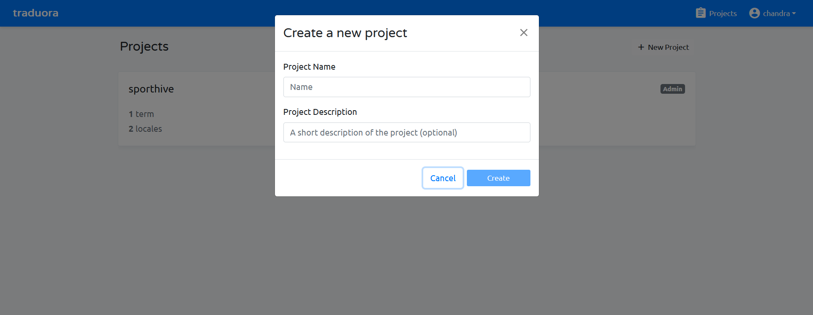
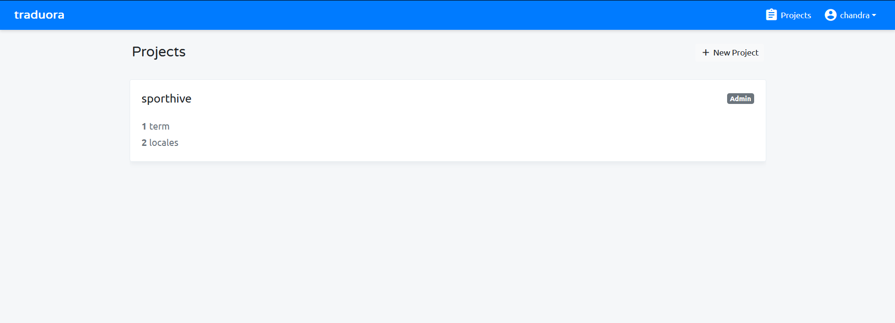
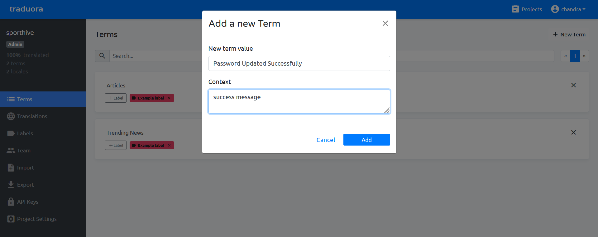
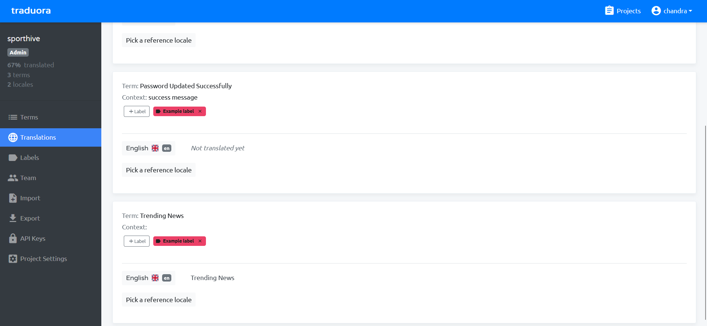
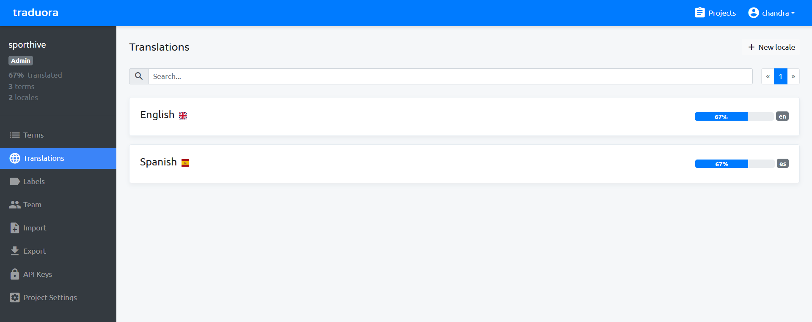
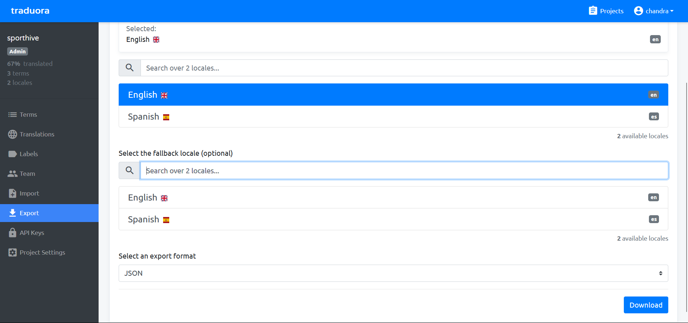
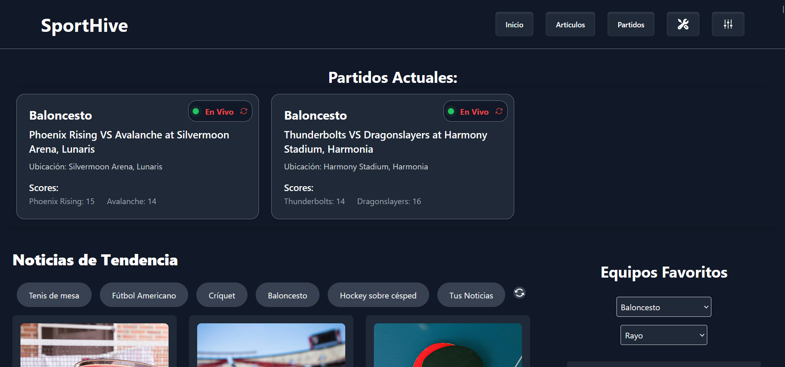
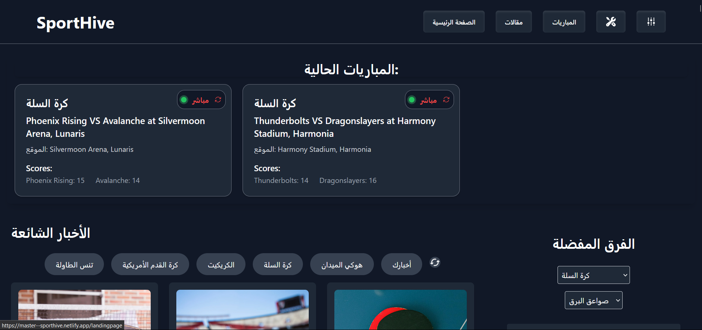
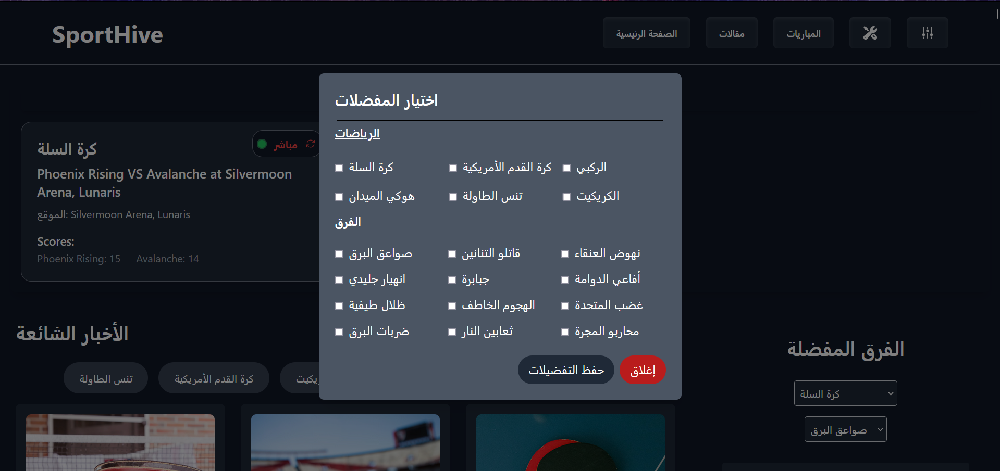

## Problem Statement
  
To complete this level, you are required to implement internationalization (i18n) and localization (l10n) features in a React.js application. The goal is to make the application accessible and user-friendly for a global audience by enabling the dynamic translation of content, localizing date and time formats, and providing the ability to switch between different locales.

  * Set up a collaborative translation tool.
  * Adding translation for each language.
  *  Setting up your React project to make use of i18n.
  *  Setting up an automatic language detector and switch the locale according to it.

---

## Approach
I took My wd301 capstone project as an example to illustrate this problem statement.

GitHub repo I worked on : https://github.com/chandramoulisangabathula01/sporthive/tree/master

I worked on this project and implemented all the i18n and l10n.

##  Set Up a Collaborative Translation Tool

### Implementing i18n and l10n with Traduora in React.js
  Traduora is an open-source translation management platform that allows teams to collaborate on translations effectively. It provides a user-friendly interface for managing localization projects, supports multiple formats, and integrates well with various applications.

  Self-Hosting Traduora:
  
  If we prefer to have full control over our translation management system, we can self-host Traduora using Docker.

  Steps:

  1. Clone the Traduora Repository:

         git clone https://github.com/ever-co/ever-traduora
         cd ever-traduora
         docker-compose -f docker-compose.demo.yaml up

  2.Access the Traduora Web Interface: 
  
  * Open the browser and navigate to http://localhost:8080 .
  * Register an admin account and log in to start managing translations.

    Benefits:
    
      * Complete control over data and configurations.
      * we can able to customize and extend functionalities as needed

** step by step:

creating the new project:



opening the created project:
    


creating the new term: 
    


translating the terms: 
    


progress of the translation:
    

  
exporting the json file
    


### advantages:

  1. Cost-Effective and Open-Source: Traduora is a free, open-source translation tool, making it accessible and budget-friendly for developers and organizations.
  2. Real-Time Collaboration: It enables teams to collaborate on translations simultaneously, improving efficiency and workflow.
  3. Wide Language and Locale Support: Traduora supports a broad range of languages and locales, making it ideal for global applications.
  4. Self-Hosting for Data Control: Traduora can be self-hosted, providing full control over data security and infrastructure management.

  
  
---

## 2. Adding translation for each language:

Step 1: Create a folder structure for our translations

Example: locale

```index.bash
src/
├── locale/
│   ├── en.json
│   ├── es.json
│   └── ar.json

```
Step 2: Populate the JSON files with translation keys and values.

  en.json (English):

```en.json
{
    "articles": "articles",
    "Articles": "Articles",
    "Your News": "Your News",
    "Trending News": "Trending News",
    "Read more": "Read more",
    "Loading articles...": "Loading articles...",
    "Teams": "Teams",
    "Loading...": "Loading...",

    "Current Matches:": "Current Matches:",
    "Live": "Live",
    "Location:": "Location:",
    "Scores:": "Scores:",
    "Preferred Matches:": "Preferred Matches:",
    "Location: ": "Location: ",
    "Ends at: ": "Ends at: ",
    "Teams:": "Teams:",
    "Match List": "Match List",
}
```
ar.json (Arabic):
```ar.json
{
    "articles": "مقالات",
    "Articles": "مقالات",
    "Your News": "أخبارك",
    "Trending News": "الأخبار الشائعة",
    "Read more": "اقرأ المزيد",
    "Loading articles...": "جاري تحميل المقالات...",
    "Teams": "الفرق",
    "Loading...": "جاري التحميل...",

    "Current Matches:": "المباريات الحالية:",
    "Live": "مباشر",
    "Location:": "الموقع:",
    "Scores:": "النتائج:",
    "Preferred Matches:": "المباريات المفضلة:",
    "Location: ": "الموقع: ",
    "Ends at: ": "ينتهي عند: ",
    "Teams:": "الفرق:",
    "Match List": "قائمة المباريات",
}
```

## 3. Setting Up Your React Project to Use i18n

   Step 1: Install necessary libraries:

   * Install i18next and react-i18next for managing translations.

         npm install i18next react-i18next
     
   Step 2: Initialize i18next in our project.

   * Create an i18n.ts file:
  
```i18n.ts

import i18n from "i18next";
import {initReactI18next} from "react-i18next";
import enJSON from "./locale/en.json"
import esJSON from "./locale/es.json"
import arJSON from "./locale/ar.json"


i18n
  
    .use(initReactI18next)
    .init({
        debug: true,
        resources: {
            en: { translation: enJSON },
            es: { translation: esJSON },
            ar: { translation: arJSON},
       

        },
        lng: 'en',
        fallbackLng: "en",
        interpolation: {
            escapeValue: false
        }
    })

```
Step 3: Wrap the App component with I18nextProvider:

App.tsx

```app.tsx

import React, { Suspense } from 'react';
import "./i18n";
import { AuthProvider } from './context/AuthorizeCxt';
import { RouterProvider } from "react-router-dom";
import router from './routes';

const App: React.FC = () => {
  return (
    <Suspense fallback={<>Loading...</>}>
    <AuthProvider>
      <RouterProvider router={router} />
    </AuthProvider>
    </Suspense>
  );
};


export default App;
```


## 4. Setting Up Automatic Language Detection and Locale Switching
   
Step 1: Install a language detector plugin:

  * by Using i18next-browser-languagedetector:
    
        npm install i18next-browser-languagedetector

Step 2: Integrating the language detector:

  * By modify i18n.ts:

```i18n.ts
import i18n from "i18next";
import {initReactI18next} from "react-i18next";
import LanguageDetector from "i18next-browser-languagedetector";
import enJSON from "./locale/en.json"
import esJSON from "./locale/es.json"
import arJSON from "./locale/ar.json"


i18n
    .use(LanguageDetector)
    .use(initReactI18next)
    .init({
        debug: true,
        resources: {
            en: { translation: enJSON },
            es: { translation: esJSON },
            ar: { translation: arJSON},

        },
        lng: 'en',
        fallbackLng: "en",
        interpolation: {
            escapeValue: false
        }
    })

```

Step 3: Adding a locale switcher UI component:

  * Example: navbar.tsx

```navbar.tsx
import React, { useState ,useEffect} from 'react';
import { Menu, MenuButton, MenuItem, MenuItems, Transition } from '@headlessui/react'
import { useTranslation } from 'react-i18next';

const Navbar: React.FC = () => {

    const { i18n } = useTranslation();
    const { t } = useTranslation();

    const LanguageSwitch = (lang: string) => {
        i18n.changeLanguage(lang);
        localStorage.setItem('language', lang);
    };
   useEffect(() => {
          const savedLanguage = localStorage.getItem('language');
          if (savedLanguage) {
            i18n.changeLanguage(savedLanguage);
          }
      }, [i18n]);
  return (
      <MenuItem>
        <button
          onClick={() => LanguageSwitch('en')}
          className="group flex w-full items-center gap-2 rounded-lg py-1.5 px-3 data-[focus]:bg-white/10"
        >
          English
        </button>
      </MenuItem>
      <MenuItem>
        <button
          onClick={() => LanguageSwitch('es')}
          className="group flex w-full items-center gap-2 rounded-lg py-1.5 px-3 data-[focus]:bg-white/10"
        >
          Español
        </button>
      </MenuItem>
      <MenuItem>
        <button
          onClick={() => LanguageSwitch('ar')}
          className="group flex w-full items-center gap-2 rounded-lg py-1.5 px-3 data-[focus]:bg-white/10"
        >
          عربي
        </button>
      </MenuItem>
  );

};

```

## 5. Localizing Date and Time Formats

The Intl.DateTimeFormat constructor is a part of the ECMAScript Internationalization API (ECMA-402), which is natively supported in modern web browsers.

```dateAndTime.ts
export const DateAndTime = (dateString: any, locale: any) => {
    return new Intl.DateTimeFormat(locale, {
        year: 'numeric',
        month: 'long',
        day: 'numeric',
        hour: 'numeric',
        minute: 'numeric',
        second: 'numeric'
    }).format(new Date(dateString));
};
```
Using formatDate Function in Components:

```ArticleList.tsx
import { DateAndTime } from '../../components/dateAndTime';
import { useTranslation } from 'react-i18next';

const ArticleOverview: React.FC = () => {
   const { t, i18n } = useTranslation();

 return (

    {t('Ends at: ')}: {DateAndTime(currentArticle.date, i18n.language)}

);
};
```

"Ends at: " followed by the formatted date and time for the **currentArticle.date** property, taking into account the current user's language preference.


## proof of work:

### spanish Homepage:



### urdu Homepage:



### spanish preferences list:




